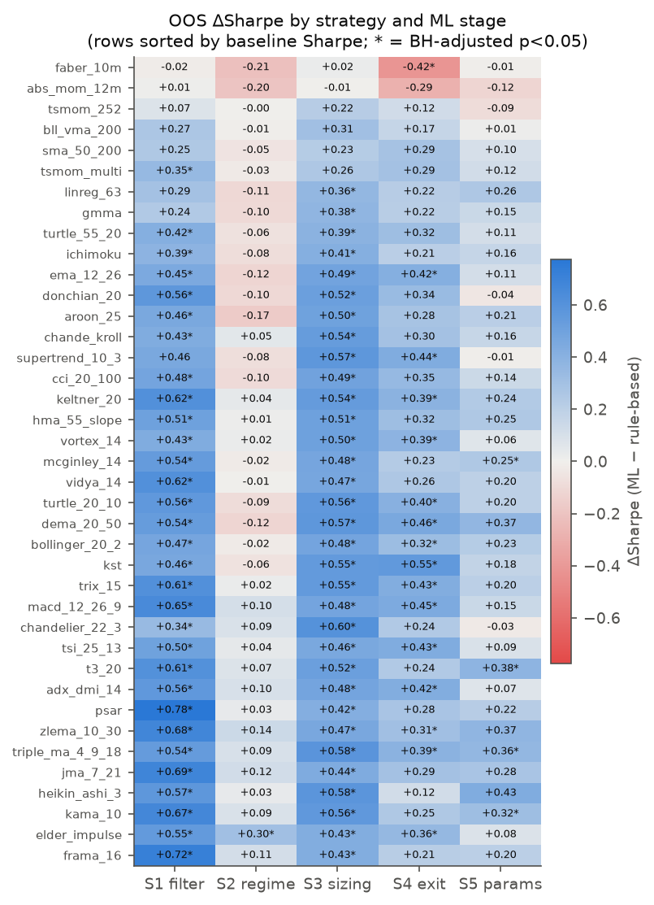
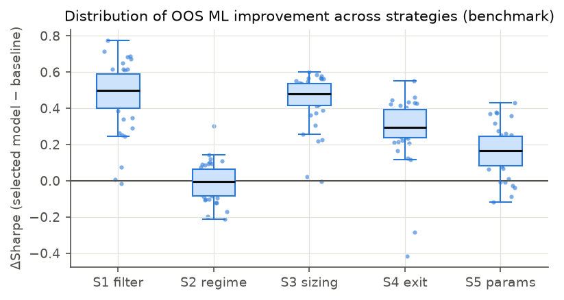
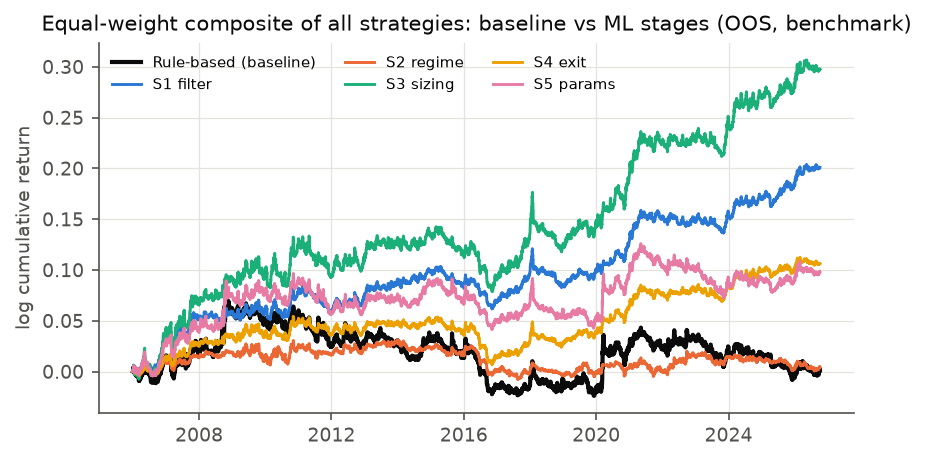
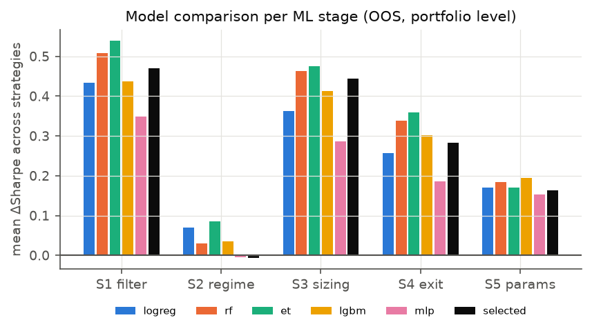
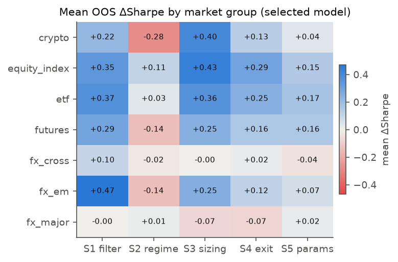
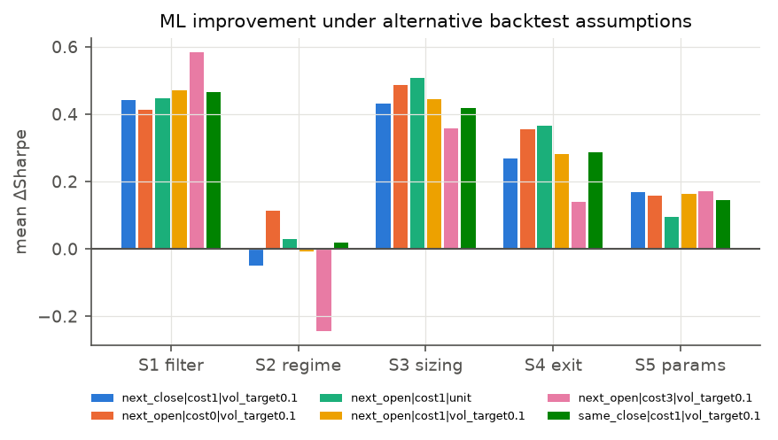

# Does Machine Learning Improve Trend Following? A Stage-by-Stage, Multi-Asset, Walk-Forward Evaluation of 39 Rule-Based Strategies

*Research repository: `qresearch.tfml`. Benchmark run code hash
`c5eca8e4b21125d6`, dataset hash `db291a67e4f96983`.
Every number below is generated from the experiment registry. See §11.*

## Abstract

PLACEHOLDER


## 1. Introduction

Trend following is among the oldest and best-documented systematic trading styles. Its
rules (moving-average crossovers, channel breakouts, volatility stops, time-series
momentum) are simple, public and decades old. Machine learning is now routinely bolted
onto such rules to filter signals, detect regimes, size positions or adapt parameters.
Claims about the value of doing so are rarely measured against the rule itself under one
controlled protocol. ML papers report the profitability of an ML strategy. Practitioners
report that "the filter helped" on the instrument where it was tuned.

This paper asks a narrower and more useful question:

> **How much does ML improve established trend-following strategies over their original
> rule-based implementations, and under what market, instrument, strategy, indicator,
> model and validation conditions does the improvement remain statistically significant
> and robust?**

We answer it with a controlled, stage-by-stage design:

1. **39 published trend-following rules** are implemented faithfully as baselines. ML is
   then inserted at **five separate stages** of the trading pipeline, each evaluated
   against the same baseline:
   - signal filtering / trade selection
   - trend-regime detection
   - position sizing
   - exit decisions
   - parameter adaptation
2. At every stage **five model families** compete (logistic regression, random forest,
   extra trees, gradient boosting, neural network). The winner is chosen only on a
   validation block that precedes each out-of-sample year. Every alternative is reported
   as well.
3. The test bed is a public multi-asset daily panel: equity indices, futures, FX,
   crypto and ETFs on many exchanges and regions. Robustness panels cover 1-hour and
   4-hour crypto bars and a survivorship-biased single-stock universe, which is reported
   as such.
4. Inference accounts for the size of the search:
   - block-bootstrap and HAC tests of Sharpe differences
   - Holm and Benjamini–Hochberg adjustment across the 195 strategy × stage tests
   - Hansen's SPA and White's Reality Check within each strategy
   - probability of backtest overfitting and deflated Sharpe ratios
   - a **placebo control** that applies each ML decision rule with random instead of
     model predictions, isolating the information contributed by ML from the mechanical
     effect of intervening.

The framework is modular: data, strategies, indicators, models, stages, validation and
backtest mechanics are all swappable. Every number in the paper is generated from an
experiment registry that links each result to its strategy, indicators, market,
instrument, dataset hash, ML stage, model, validation design, backtest configuration and
code version.


## 2. Related literature

**Trend following.** Rule-based trend following has a long empirical record:

- Moving-average and channel-breakout rules (Donchian 1960; Brock, Lakonishok & LeBaron 1992).
- Time-series momentum across futures markets (Moskowitz, Ooi & Pedersen 2012) and over a
  century of data (Hurst, Ooi & Pedersen 2017).
- Simple tactical rules such as Faber's (2007) 10-month moving average and Antonacci's
  (2014) absolute momentum.

Sullivan, Timmermann & White (1999) showed that the apparent profitability of
technical-rule *universes* must be judged against the data-snooping implied by searching
over them.

**ML on top of rules.** López de Prado (2018) proposed *meta-labelling*: a secondary
classifier decides whether to act on a primary model's signal and how much to bet.
Lim, Zohren & Roberts (2019) learn trend-following positions with deep networks. Gu,
Kelly & Xiu (2020) document gains from tree ensembles and neural networks for return
prediction, under strict train/validation/test splits.

**Inference.** We rely on:

- Ledoit & Wolf (2008) for Sharpe-ratio differences.
- White's (2000) Reality Check and Hansen's (2005) SPA test for "best of many" comparisons.
- Romano & Wolf (2005) stepdown FWER control.
- Benjamini & Hochberg (1995) and Benjamini & Yekutieli (2001) for FDR.
- Bailey & López de Prado (2014) for the deflated Sharpe ratio, and Bailey, Borwein,
  López de Prado & Zhu (2017) for the probability of backtest overfitting.

Harvey, Liu & Zhu (2016) argue for higher significance hurdles in factor research. The
same multiplicity concern applies here, with 39 strategies × 5 stages × 5 models.

What is missing from this literature is a *controlled, stage-by-stage* measurement. The
question is not whether an ML trading model can be profitable. It is how much ML adds to
a given, published trend rule, at which point in the pipeline, and with what statistical
confidence once the search over models and configurations is accounted for.


## 3. Data

The benchmark universe holds 174 instruments with daily
bars, 1,100,307 instrument-days in total. It spans equity indices
(34 indices across five regions), continuous futures (equity, rates, energy,
metals, agriculture, softs, livestock, currencies), FX majors, crosses and emerging-market
pairs, large-cap cryptocurrencies, and US-listed ETFs (equity, country, sector, rates,
credit, commodity, real estate, currency). Two extra panels are kept out of the
benchmark:

- Binance spot crypto at 1-hour and 4-hour bars (frequency robustness).
- Single stocks from the *current* S&P 100 and NIFTY 50 (survivorship-biased by
  construction; used only as a labelled robustness run).

Over all frequencies we use 259 cleaned series
(2,670,334 bars). Table T1 lists coverage per group. Sources, cleaning
rules and limitations are in `docs/TFML_DATA.md`. Cleaning removed
625 isolated bad prints, widened 16,962 inconsistent
high/low values (mostly Yahoo FX), and trimmed series with holes longer than one month to
the segment after the last hole.

| group                      | freq          |   instruments | first_start   | end        |   total_bars |   spikes_removed |   rows_trimmed_gap | source   | survivorship         | benchmark   |
|:---------------------------|:--------------|--------------:|:--------------|:-----------|-------------:|-----------------:|-------------------:|:---------|:---------------------|:------------|
| crypto                     | daily         |            15 | 2014-09-17    | 2026-10-06 |    49208.000 |            2.000 |              0.000 | yahoo    | partial              | True        |
| crypto_binance_intraday    | 1h            |            12 | 2017-08-17    | 2026-09-30 |   865205.000 |          175.000 |              0.000 | binance  | partial              | False       |
| crypto_binance_intraday    | 4h            |            12 | 2017-08-17    | 2026-09-30 |   216493.000 |          175.000 |              0.000 | binance  | partial              | False       |
| crypto_binance_intraday    | daily_binance |            12 | 2017-08-17    | 2026-09-30 |    36104.000 |          175.000 |              0.000 | binance  | partial              | False       |
| equity_index               | daily         |            34 | 1985-01-02    | 2026-10-06 |   284573.000 |            9.000 |              0.000 | yahoo    | none                 | True        |
| etf                        | daily         |            49 | 1993-01-29    | 2026-10-06 |   313490.000 |            9.000 |              0.000 | yahoo    | none                 | True        |
| futures                    | daily         |            37 | 2000-01-03    | 2026-10-06 |   229210.000 |            8.000 |           6693.000 | yahoo    | none                 | True        |
| fx_cross                   | daily         |            21 | 1999-01-04    | 2026-10-06 |   126494.000 |            8.000 |             86.000 | yahoo    | none                 | True        |
| fx_em                      | daily         |            11 | 2003-12-01    | 2026-10-06 |    64354.000 |           13.000 |           1110.000 | yahoo    | none                 | True        |
| fx_major                   | daily         |             7 | 1996-10-30    | 2026-10-06 |    42846.000 |            7.000 |              0.000 | yahoo    | none                 | True        |
| india_stocks_nifty_current | daily         |            19 | 1996-01-01    | 2026-10-06 |   131760.000 |           35.000 |              0.000 | yahoo    | current_constituents | False       |
| us_stocks_sp100_current    | daily         |            30 | 1985-01-02    | 2026-10-06 |   310597.000 |            9.000 |              0.000 | yahoo    | current_constituents | False       |

## 4. Strategies and indicators

We implement 39 published or widely used trend-following rules (Table T2).
They span eight families: moving-average crossovers, price-vs-MA filters, adaptive moving
averages, channel breakouts, volatility stops, time-series momentum, oscillator-based
trend rules and directional-movement systems. Each rule maps OHLC history up to the close
of bar *t* to a target position *p_t* ∈ [−1, 1], with parameters set to the originator's
defaults. Rules are long/short (stop-and-reverse or with a flat state where the original
has one). The two long-only exceptions follow their sources: Faber's 10-month MA and
Antonacci's absolute momentum. For parameter adaptation (stage S5) each rule also has a
*slow* (lookbacks ×2) and a *fast* (×0.5) variant.

The ML models see 56 features drawn from 10
indicator families (Table T3): momentum at 5–252 bars; five volatility estimators
(close-to-close, Parkinson, Garman–Klass, Rogers–Satchell, Yang–Zhang); ADX/DMI; Aroon;
RSI; MACD; stochastics; CCI; TRIX; Vortex; Kaufman efficiency ratio; choppiness;
regression slope t-statistics and R²; distances to SMA/KAMA/PSAR/SuperTrend/Ichimoku
levels; Bollinger, Keltner and Donchian channel positions; variance ratio and
autocorrelation; higher moments; drawdown state; and four volume features. Every feature
is dimensionless (ratio, oscillator or volatility-scaled distance), so one pooled model
serves all instruments.

Two causality checks are unit-tested for all 56 features and 39 rules: the value at bar *t*
is identical whether computed on the full history or on history truncated at *t*. That
test caught one subtle look-ahead during development. A month-end rebalancing flag set on
the last available bar made a truncated series rebalance on a day the full series would
not.

## 5. ML enhancement stages and models

ML is inserted at five clearly separated points. Each stage is evaluated **on its own
against the same rule-based baseline**, so its incremental effect is identified:

| Stage | Pipeline role | Model target | Decision rule |
|---|---|---|---|
| S1 filter | signal filtering / trade selection (meta-labelling) | P(trade's net open-to-open return > 0), features at entry | skip a new trade if its probability falls below a validation-quantile threshold; stay flat until the next signal |
| S2 regime | trend / regime detection (strategy-agnostic) | P(forward 20-bar Kaufman efficiency ratio > training median) | hold the rule's position only while the trending-regime probability exceeds the threshold |
| S3 sizing | position sizing | P(direction of current position is right over the next 10 bars) | scale the position by 2·F(q), where F is the empirical CDF of validation predictions (mean multiplier ≈ 1, range 0–2) |
| S4 exit | entry/exit decisions | same as S3 | exit an open trade when the probability drops below the threshold; re-enter only on the next rule signal |
| S5 params | parameter adaptation | which of the slow/base/fast variants has the best net return over the next 21 bars (3-class) | each month, trade the variant with the highest predicted probability |

Bar-level model outputs (S2–S4) go through a causal 5-bar EMA before any decision, a
setting fixed before the study. Without it, day-to-day prediction noise churned positions
and multiplied turnover. The intervention intensity (S1/S2: 20/35/50% quantile; S4:
10/20/30%) is the only decision parameter tuned, and only on validation data.

Every stage trains **five models** with hyper-parameters fixed a priori:

- L2-regularised logistic regression.
- A random forest (100 bagged trees, depth 7, 15% features per tree).
- Extremely randomised trees.
- LightGBM gradient boosting (200 trees, 15 leaves, learning rate 0.03).
- A two-layer MLP (32-16) with early stopping.

Minimum leaf sizes scale with the training-set size. Models are pooled across all
instruments of the panel (one model per strategy, stage and fold). Bar-level training
rows are sub-sampled at the label horizon, so labels from one instrument do not overlap.

## 6. Validation and backtesting protocol (benchmark configuration)

**Walk-forward with purging.** Test years run from 2006
to 2026, one fold per calendar year. For test year *Y*:

- Models are trained on all data before *Y*−2 (expanding window).
- Model and intensity are selected on the validation block [*Y*−2, *Y*).
- The frozen choice is applied to *Y*.

A training row is admitted only if its label is fully realised (horizon plus a 5-bar
embargo) before the validation block starts. Validation labels must be realised before
the test year. The *selected* configuration is the (model, intensity) pair with the
highest validation-period portfolio Sharpe ratio. Each alternative model keeps its own
validation-chosen intensity, so all five models are also reported out of sample, but
nothing out of sample feeds back into any choice. The out-of-sample (OOS) record is the
concatenation of the test years, 2006-01-02..2026-10-06.

**Execution and costs.** A target decided at the close of bar *t* is executed at the
**open of bar t+1**. The overnight gap belongs to the previous position, so a signal never
earns the jump that created it. Each unit of position change pays a per-side cost plus
slippage by asset class: 2 bps for indices and ETFs, 3 bps for futures, 1–6 bps for FX
majors/crosses/EM, and 12.5 bps for crypto (taker fee plus slippage).

**Sizing and aggregation.** At the instrument level, rules trade unit notional, as in
their original specifications. At the portfolio level, each instrument's position is
scaled to 10% annualised volatility (EWMA, causal, leverage cap 3×). Instruments get
equal capital, and the portfolio return on a date is the sum of instrument returns
divided by the number of instruments live at that date.

**Alternative mechanisms**, reported for the baseline and every selected ML stage:

- costs at 0× and 3×
- next-close execution (one bar of extra delay)
- same-close execution (the optimistic textbook convention)
- unit sizing

Alternative validation designs are separate runs:

- a rolling 10-year training window
- a single 2013 hold-out split with no retraining

## 7. Statistical inference

For each strategy and stage we test H₀: SR(ML) = SR(rule-based) on the paired daily OOS
portfolio returns:

- **Portfolio level:** a paired circular block bootstrap (block 20 days, 2,000 resamples).
- **Instrument level:** the Ledoit–Wolf (2008) HAC delta-method test.

The headline family is the 39 strategies × 5 stages = 195 portfolio-level tests, reported
raw and with Holm (FWER) and Benjamini–Hochberg (FDR) adjustment. Within each strategy,
Hansen's SPA test and White's Reality Check ask whether *any* of the 25 stage × model
configurations beats the baseline. We also report Romano–Wolf stepdown p-values. To
diagnose selection overfitting we compute the probability of backtest overfitting (CSCV,
16 blocks) across each strategy's 26 configurations and the deflated Sharpe ratio of the
ex-post best configuration. Finally, an OLS regression with instrument-clustered standard
errors relates instrument-level ΔSharpe to stage, model, strategy family, asset class and
the baseline's own Sharpe: the "under what conditions" question.


## 8. Results

All results in this section are out of sample:
2006-01-02..2026-10-06, 174 instruments,
next-open execution, 1× costs. "ΔSharpe" is the annualised Sharpe ratio of the
ML-enhanced strategy minus that of its own rule-based baseline on identical days. The
selected model is the validation winner, never the ex-post best.

### 8.1 The rule-based baselines

Over 2006–2026 and after costs, the 39 published rules earn an average portfolio Sharpe of
0.01 (median
-0.01). Only 18
of 39 have a positive Sharpe. The best are the slow,
long-only or monthly rules: `faber_10m` reaches
0.85. The worst is `frama_16`
at -0.83. This matches the well-documented weak
decade for trend following after 2009. Fast crossovers and adaptive moving averages pay
substantial costs for whipsaw trades. Full metrics (CAGR, total return, volatility,
Sharpe, Sortino, Calmar, maximum drawdown, win rate, profit factor, turnover, cost drag,
exposure, stability) are in Appendix C.

### 8.2 How much does ML improve the rules? (headline)

| stage     |   n_strategies |   mean_dSharpe |   median_dSharpe |   share_improved |   sig_pos_raw |   sig_pos_holm |   sig_pos_bh |   sig_neg_bh |   mean_d_maxdd |   mean_d_turnover |   sign_test_p |
|:----------|---------------:|---------------:|-----------------:|-----------------:|--------------:|---------------:|-------------:|-------------:|---------------:|------------------:|--------------:|
| S1_filter |             39 |          0.470 |            0.498 |            0.974 |            34 |             10 |           31 |            0 |          0.087 |           -14.332 |         0.000 |
| S2_regime |             39 |         -0.007 |           -0.006 |            0.462 |             1 |              0 |            1 |            0 |          0.064 |            -4.357 |         0.749 |
| S3_sizing |             39 |          0.444 |            0.481 |            0.974 |            35 |             16 |           33 |            0 |          0.050 |             6.755 |         0.000 |
| S4_exit   |             39 |          0.282 |            0.296 |            0.949 |            21 |              1 |           15 |            1 |          0.073 |            -6.304 |         0.000 |
| S5_params |             39 |          0.164 |            0.165 |            0.846 |             7 |              0 |            4 |            0 |          0.038 |            -2.809 |         0.000 |

*Table 5. ΔSharpe of the validation-selected model per stage, across 39 strategies.*
`sig_*` counts strategies with a significant improvement (two-sided paired block
bootstrap, α = 5%), raw and after Holm and Benjamini–Hochberg adjustment over all 195
strategy × stage tests. `mean_d_maxdd` > 0 means shallower drawdowns. `mean_d_turnover`
is the change in annual turnover.

The answer depends sharply on **where** ML is inserted:

- **Trade selection (S1)** and **position sizing (S3)** give the largest and most
  reliable improvements:
  - S1: mean ΔSharpe +0.47;
    97% of strategies improved;
    10 significant after Holm and
    31 after BH.
  - S3: +0.44;
    97% improved;
    16 significant after Holm and
    33 after BH.
- **ML exits (S4)** help on average
  (+0.28), but individually
  less reliably: 15 strategies are
  significant after BH and 1
  after Holm.
- **Parameter adaptation (S5)** adds little
  (+0.16; significant for
  4 strategies after BH and
  0 after Holm).
- **The strategy-agnostic trend-regime gate (S2) does not help**: mean ΔSharpe
  -0.007, with improvements in
  only 46% of strategies.
  Predicting *that* a market will trend is not the same as predicting that a given rule's
  current position will pay. Only the latter, strategy-specific target produced gains.
  S2 is also the only stage where validation-based selection actively hurts. Every
  individual model except the MLP has a slightly positive mean OOS ΔSharpe (Table 8; e.g.
  extra trees
  +0.085),
  but the fold-by-fold validation winner does not. The gate's effects are too small and
  unstable for a 2-year validation block to rank reliably.

Across all 195 tests, 27 improvements survive the
Holm family-wise correction and 84 survive BH. Only
1 significant *deteriorations* survive BH. Within
each strategy, Hansen's SPA test rejects "no ML configuration beats the rule" for
38 of 39 strategies
(38 after Holm across strategies; White's Reality
Check: 37).



*Figure 1. OOS ΔSharpe for every strategy × stage (selected model). Rows sorted by baseline Sharpe; * marks BH-adjusted p < 0.05.*



*Figure 2. Distribution of ΔSharpe across the 39 strategies per stage.*

**A diversified view.** The equal-weight composite of all 39 strategies (Table 17) has a
rule-based Sharpe of 0.01. With ML trade
selection it is 0.60
(ΔSharpe +0.59, 95% CI
[0.24,
0.96], p =
0.003). With ML sizing it is
0.57
(p = 0.001). Maximum drawdown
falls from -9.5% to
-4.1% (S1). The composite is
very diversified across instruments and rules, so its volatility is low
(2.2% for the baseline): Sharpe ratios,
not raw CAGRs, are the meaningful comparison.

| config    |   cagr |   total_return |   ann_vol |   sharpe |   sortino |   calmar |   max_drawdown |   pct_pos_years |   stability_r2 |   d_sharpe |   p_boot_two |   ci_lo |   ci_hi |
|:----------|-------:|---------------:|----------:|---------:|----------:|---------:|---------------:|----------------:|---------------:|-----------:|-------------:|--------:|--------:|
| base      |  0.000 |          0.001 |     0.022 |    0.014 |     0.019 |    0.001 |         -0.095 |           0.524 |         -0.082 |    nan     |      nan     | nan     | nan     |
| S1_filter |  0.010 |          0.223 |     0.016 |    0.604 |     0.821 |    0.238 |         -0.041 |           0.714 |          0.892 |      0.590 |        0.003 |   0.239 |   0.955 |
| S2_regime |  0.000 |          0.005 |     0.011 |    0.025 |     0.034 |    0.006 |         -0.038 |           0.524 |         -0.128 |      0.012 |        0.934 |  -0.267 |   0.295 |
| S3_sizing |  0.014 |          0.347 |     0.026 |    0.572 |     0.781 |    0.235 |         -0.062 |           0.810 |          0.874 |      0.559 |        0.001 |   0.257 |   0.870 |
| S4_exit   |  0.005 |          0.112 |     0.013 |    0.391 |     0.537 |    0.111 |         -0.046 |           0.714 |          0.680 |      0.378 |        0.008 |   0.095 |   0.665 |
| S5_params |  0.005 |          0.103 |     0.021 |    0.237 |     0.329 |    0.088 |         -0.054 |           0.571 |          0.430 |      0.224 |        0.012 |   0.057 |   0.404 |



*Figure 3. Cumulative OOS log return of the 39-strategy composite: rule-based vs each ML stage.*

**Portfolio vs single instrument.** At the instrument level (unit size, the rules exactly
as published), the improvements are real but much smaller:

- S1: mean ΔSharpe +0.12
  over 6786 strategy-instrument
  pairs, 77% improved,
  86 significant after BH.
- S3: +0.12,
  264 significant.

Single-instrument Sharpe ratios are noisy. The portfolio-level gains arise because small,
consistent per-instrument improvements add up across 174 weakly correlated instruments.
A practitioner trading one market should expect the instrument-level effect, not the
portfolio-level one.

### 8.3 Which model, and does selection work?

| ml_stage   | ml_model   |   mean_dSharpe |   share_improved |   sig_pos |   sig_neg |   times_selected |   selection_share |
|:-----------|:-----------|---------------:|-----------------:|----------:|----------:|-----------------:|------------------:|
| S1_filter  | et         |          0.539 |            0.949 |        35 |         0 |              414 |             0.505 |
| S1_filter  | lgbm       |          0.437 |            0.949 |        37 |         0 |               91 |             0.111 |
| S1_filter  | logreg     |          0.434 |            0.949 |        34 |         0 |              101 |             0.123 |
| S1_filter  | mlp        |          0.348 |            0.949 |        30 |         0 |               77 |             0.094 |
| S1_filter  | rf         |          0.507 |            0.974 |        35 |         0 |              136 |             0.166 |
| S2_regime  | et         |          0.085 |            0.872 |         0 |         0 |              189 |             0.231 |
| S2_regime  | lgbm       |          0.035 |            0.615 |         3 |         1 |              165 |             0.201 |
| S2_regime  | logreg     |          0.070 |            0.872 |         3 |         1 |              179 |             0.219 |
| S2_regime  | mlp        |         -0.005 |            0.487 |         1 |         1 |              107 |             0.131 |
| S2_regime  | rf         |          0.030 |            0.590 |         0 |         0 |              179 |             0.219 |
| S3_sizing  | et         |          0.476 |            1.000 |        37 |         0 |              332 |             0.405 |
| S3_sizing  | lgbm       |          0.413 |            0.949 |        35 |         0 |              131 |             0.160 |
| S3_sizing  | logreg     |          0.362 |            0.949 |        33 |         0 |              128 |             0.156 |
| S3_sizing  | mlp        |          0.287 |            1.000 |        31 |         0 |               79 |             0.096 |
| S3_sizing  | rf         |          0.462 |            0.974 |        36 |         0 |              149 |             0.182 |
| S4_exit    | et         |          0.359 |            0.949 |        31 |         0 |              248 |             0.303 |
| S4_exit    | lgbm       |          0.302 |            0.949 |        29 |         1 |              169 |             0.206 |
| S4_exit    | logreg     |          0.256 |            0.949 |        24 |         1 |              144 |             0.176 |
| S4_exit    | mlp        |          0.186 |            0.872 |        15 |         0 |              124 |             0.151 |
| S4_exit    | rf         |          0.338 |            0.949 |        31 |         1 |              134 |             0.164 |
| S5_params  | et         |          0.171 |            0.923 |         7 |         0 |              161 |             0.197 |
| S5_params  | lgbm       |          0.194 |            0.949 |        11 |         0 |              250 |             0.305 |
| S5_params  | logreg     |          0.170 |            0.949 |         7 |         0 |              145 |             0.177 |
| S5_params  | mlp        |          0.153 |            0.821 |         8 |         0 |              148 |             0.181 |
| S5_params  | rf         |          0.184 |            0.897 |         9 |         0 |              115 |             0.140 |

*Table 8. OOS ΔSharpe of every model at every stage, and how often validation selected it
(over 21 folds × 39 strategies).*

Tree ensembles are the most useful models. Extra trees and random forests lead at S1, S3
and S4. Gradient boosting is competitive. The MLP is the weakest at every stage, and
logistic regression is in between. The instrument-level regression (Table 15) confirms
it: relative to logistic regression, ET adds
+0.025 and RF
+0.015 Sharpe, while the MLP
subtracts -0.026.

Validation-based selection does slightly better than the average model and clearly
worse than the ex-post best (Table 8c):

| Stage | Selected | Average model | Best ex post |
|---|---|---|---|
| S1 | +0.47 | +0.45 | +0.56 |
| S3 | +0.44 | +0.40 | +0.48 |

The gap between "selected" and "best ex post" is the price of honest model selection.
Reporting the ex-post best model would overstate the ML benefit by about
0.56 −
0.47 Sharpe
at S1.

Models' average validation scores rank their OOS results consistently (Spearman
0.95 at S3,
0.75 at S1). This is partly
mechanical. The 2-year validation block of a fold covers calendar years that are test
years of earlier folds, so models that are better in general rank similarly in both.
No fold ever uses its own test year.



*Figure 4. Mean OOS ΔSharpe by model and stage; "selected" = validation winner.*

### 8.4 Markets and instruments

| market       | ml_stage   |   mean_base_sharpe |   mean_dSharpe |   share_improved |   sig_pos_bh |   sig_neg_bh |
|:-------------|:-----------|-------------------:|---------------:|-----------------:|-------------:|-------------:|
| crypto       | S1_filter  |              0.916 |          0.219 |            0.923 |            5 |            0 |
| crypto       | S2_regime  |              0.916 |         -0.276 |            0.026 |            0 |            0 |
| crypto       | S3_sizing  |              0.916 |          0.399 |            0.974 |           32 |            0 |
| crypto       | S4_exit    |              0.916 |          0.129 |            0.846 |            0 |            0 |
| crypto       | S5_params  |              0.916 |          0.037 |            0.538 |            0 |            0 |
| equity_index | S1_filter  |              0.098 |          0.346 |            0.923 |            6 |            0 |
| equity_index | S2_regime  |              0.098 |          0.108 |            0.821 |            0 |            0 |
| equity_index | S3_sizing  |              0.098 |          0.433 |            1.000 |           28 |            0 |
| equity_index | S4_exit    |              0.098 |          0.294 |            0.949 |            0 |            0 |
| equity_index | S5_params  |              0.098 |          0.147 |            0.795 |            0 |            0 |
| etf          | S1_filter  |              0.007 |          0.371 |            0.949 |           21 |            0 |
| etf          | S2_regime  |              0.007 |          0.033 |            0.641 |            0 |            0 |
| etf          | S3_sizing  |              0.007 |          0.364 |            1.000 |           31 |            0 |
| etf          | S4_exit    |              0.007 |          0.246 |            0.949 |            0 |            0 |
| etf          | S5_params  |              0.007 |          0.169 |            0.872 |            0 |            0 |
| futures      | S1_filter  |             -0.125 |          0.292 |            0.949 |           10 |            0 |
| futures      | S2_regime  |             -0.125 |         -0.138 |            0.128 |            0 |            0 |
| futures      | S3_sizing  |             -0.125 |          0.249 |            0.974 |            8 |            0 |
| futures      | S4_exit    |             -0.125 |          0.155 |            0.872 |            1 |            0 |
| futures      | S5_params  |             -0.125 |          0.155 |            0.846 |            0 |            0 |
| fx_cross     | S1_filter  |             -0.313 |          0.101 |            0.846 |            2 |            0 |
| fx_cross     | S2_regime  |             -0.313 |         -0.020 |            0.385 |            0 |            0 |
| fx_cross     | S3_sizing  |             -0.313 |         -0.003 |            0.538 |            0 |            0 |
| fx_cross     | S4_exit    |             -0.313 |          0.015 |            0.641 |            0 |            0 |
| fx_cross     | S5_params  |             -0.313 |         -0.040 |            0.410 |            0 |            0 |
| fx_em        | S1_filter  |             -0.096 |          0.469 |            0.974 |           23 |            0 |
| fx_em        | S2_regime  |             -0.096 |         -0.136 |            0.154 |            0 |            0 |
| fx_em        | S3_sizing  |             -0.096 |          0.255 |            1.000 |           19 |            0 |
| fx_em        | S4_exit    |             -0.096 |          0.116 |            0.846 |            1 |            0 |
| fx_em        | S5_params  |             -0.096 |          0.068 |            0.692 |            1 |            0 |
| fx_major     | S1_filter  |             -0.080 |         -0.003 |            0.487 |            0 |            0 |
| fx_major     | S2_regime  |             -0.080 |          0.013 |            0.538 |            0 |            0 |
| fx_major     | S3_sizing  |             -0.080 |         -0.067 |            0.051 |            0 |            0 |
| fx_major     | S4_exit    |             -0.080 |         -0.070 |            0.256 |            0 |            0 |
| fx_major     | S5_params  |             -0.080 |          0.019 |            0.590 |            0 |            0 |

*Table 9. ΔSharpe by universe group (39 strategies each; BH within stage).*

The gains are broad but not universal:

- **Equity indices, ETFs, EM FX and crypto** benefit from S1 and S3 for nearly every
  strategy.
- **Continuous futures** benefit less.
- **G10 FX** is the exception:
  - FX majors show no ML benefit at all. S3 and S4 slightly *reduce* the Sharpe ratio
    (S3: -0.07).
  - FX crosses show only a small S1 gain
    (+0.10).

  G10 FX is the most efficiently priced, lowest-cost market in the sample, and the rules
  offer little conditional structure to exploit.

The instrument-level regression (Table 15) puts it the same way. Relative to equities, FX
instruments gain -0.120 and
futures -0.085 less
Sharpe from ML.



*Figure 5. Mean ΔSharpe by market group and stage.*

### 8.5 Strategies and indicators: when does ML help most?

| term                                 |   coef |    se |       t |     p |
|:-------------------------------------|-------:|------:|--------:|------:|
| Intercept                            |  0.169 | 0.011 |  15.967 | 0.000 |
| ml_stage=S2_regime                   | -0.093 | 0.008 | -11.098 | 0.000 |
| ml_stage=S3_sizing                   | -0.010 | 0.006 |  -1.812 | 0.070 |
| ml_stage=S4_exit                     | -0.035 | 0.005 |  -7.630 | 0.000 |
| ml_stage=S5_params                   | -0.075 | 0.005 | -14.646 | 0.000 |
| ml_model=et                          |  0.025 | 0.003 |   7.921 | 0.000 |
| ml_model=lgbm                        | -0.000 | 0.003 |  -0.157 | 0.875 |
| ml_model=mlp                         | -0.026 | 0.003 |  -8.378 | 0.000 |
| ml_model=rf                          |  0.015 | 0.003 |   4.904 | 0.000 |
| strategy_family=adaptive_ma          | -0.003 | 0.003 |  -1.213 | 0.225 |
| strategy_family=breakout             |  0.001 | 0.003 |   0.484 | 0.628 |
| strategy_family=directional          | -0.009 | 0.002 |  -3.879 | 0.000 |
| strategy_family=oscillator_trend     | -0.003 | 0.003 |  -1.269 | 0.204 |
| strategy_family=price_vs_ma          | -0.053 | 0.005 |  -9.729 | 0.000 |
| strategy_family=time_series_momentum | -0.034 | 0.004 |  -7.859 | 0.000 |
| strategy_family=volatility_stop      | -0.005 | 0.002 |  -2.028 | 0.043 |
| asset_class=crypto                   |  0.009 | 0.020 |   0.441 | 0.659 |
| asset_class=etf                      | -0.019 | 0.014 |  -1.386 | 0.166 |
| asset_class=futures                  | -0.085 | 0.014 |  -5.950 | 0.000 |
| asset_class=fx                       | -0.120 | 0.011 | -10.629 | 0.000 |
| base_sharpe                          | -0.193 | 0.016 | -11.742 | 0.000 |

*Table 15. Instrument-level ΔSharpe (all stages × models, n =
169,650) regressed on design factors; standard errors
clustered by instrument; R² = 0.190.*

The strongest single predictor of the ML benefit is **how good the rule already is**.
The coefficient on the baseline's own Sharpe is
-0.193 (t =
-11.7). By family (Table 13):

- The slow, well-performing price-vs-MA rules (Faber, BLL; mean baseline Sharpe
  0.65)
  gain only +0.12
  from S1.
- Time-series momentum (baseline
  0.48)
  gains +0.18.
- Fast adaptive moving averages (baseline
  -0.25)
  gain +0.61.

ML mostly **repairs weak rules**, largely by removing trades it expects to lose. S1
changes annual portfolio turnover by
-14.3 units on average
(fewer trades). It improves established strong rules much less. Section 8.9 tests
whether the benefit survives a placebo with the same turnover reduction.

| strategy_family      | ml_stage   |   n |   mean_base_sharpe |   mean_dSharpe |   share_improved |
|:---------------------|:-----------|----:|-------------------:|---------------:|-----------------:|
| adaptive_ma          | S1_filter  |   6 |             -0.247 |          0.610 |            1.000 |
| adaptive_ma          | S2_regime  |   6 |             -0.247 |          0.044 |            0.667 |
| adaptive_ma          | S3_sizing  |   6 |             -0.247 |          0.493 |            1.000 |
| adaptive_ma          | S4_exit    |   6 |             -0.247 |          0.254 |            1.000 |
| adaptive_ma          | S5_params  |   6 |             -0.247 |          0.266 |            1.000 |
| breakout             | S1_filter  |   5 |              0.053 |          0.526 |            1.000 |
| breakout             | S2_regime  |   5 |              0.053 |         -0.047 |            0.200 |
| breakout             | S3_sizing  |   5 |              0.053 |          0.499 |            1.000 |
| breakout             | S4_exit    |   5 |              0.053 |          0.355 |            1.000 |
| breakout             | S5_params  |   5 |              0.053 |          0.147 |            0.800 |
| directional          | S1_filter  |   5 |             -0.056 |          0.482 |            1.000 |
| directional          | S2_regime  |   5 |             -0.056 |         -0.021 |            0.600 |
| directional          | S3_sizing  |   5 |             -0.056 |          0.495 |            1.000 |
| directional          | S4_exit    |   5 |             -0.056 |          0.283 |            1.000 |
| directional          | S5_params  |   5 |             -0.056 |          0.187 |            1.000 |
| ma_crossover         | S1_filter  |   7 |             -0.020 |          0.485 |            1.000 |
| ma_crossover         | S2_regime  |   7 |             -0.020 |         -0.006 |            0.429 |
| ma_crossover         | S3_sizing  |   7 |             -0.020 |          0.449 |            1.000 |
| ma_crossover         | S4_exit    |   7 |             -0.020 |          0.340 |            1.000 |
| ma_crossover         | S5_params  |   7 |             -0.020 |          0.249 |            1.000 |
| oscillator_trend     | S1_filter  |   6 |             -0.189 |          0.543 |            1.000 |
| oscillator_trend     | S2_regime  |   6 |             -0.189 |          0.052 |            0.667 |
| oscillator_trend     | S3_sizing  |   6 |             -0.189 |          0.493 |            1.000 |
| oscillator_trend     | S4_exit    |   6 |             -0.189 |          0.427 |            1.000 |
| oscillator_trend     | S5_params  |   6 |             -0.189 |          0.141 |            1.000 |
| price_vs_ma          | S1_filter  |   2 |              0.652 |          0.125 |            0.500 |
| price_vs_ma          | S2_regime  |   2 |              0.652 |         -0.109 |            0.000 |
| price_vs_ma          | S3_sizing  |   2 |              0.652 |          0.164 |            1.000 |
| price_vs_ma          | S4_exit    |   2 |              0.652 |         -0.125 |            0.500 |
| price_vs_ma          | S5_params  |   2 |              0.652 |          0.002 |            0.500 |
| time_series_momentum | S1_filter  |   4 |              0.482 |          0.180 |            1.000 |
| time_series_momentum | S2_regime  |   4 |              0.482 |         -0.083 |            0.000 |
| time_series_momentum | S3_sizing  |   4 |              0.482 |          0.208 |            0.750 |
| time_series_momentum | S4_exit    |   4 |              0.482 |          0.088 |            0.750 |
| time_series_momentum | S5_params  |   4 |              0.482 |          0.043 |            0.500 |
| volatility_stop      | S1_filter  |   4 |             -0.049 |          0.500 |            1.000 |
| volatility_stop      | S2_regime  |   4 |             -0.049 |          0.024 |            0.750 |
| volatility_stop      | S3_sizing  |   4 |             -0.049 |          0.531 |            1.000 |
| volatility_stop      | S4_exit    |   4 |             -0.049 |          0.313 |            1.000 |
| volatility_stop      | S5_params  |   4 |             -0.049 |          0.086 |            0.500 |

### 8.6 Time periods

| period    | ml_stage   |   mean_base_sharpe |   mean_dSharpe |   share_improved |   sig_pos |   sig_neg |
|:----------|:-----------|-------------------:|---------------:|-----------------:|----------:|----------:|
| 2006-2010 | S1_filter  |              0.318 |          0.332 |            0.897 |         8 |         0 |
| 2006-2010 | S2_regime  |              0.318 |         -0.096 |            0.308 |         0 |         0 |
| 2006-2010 | S3_sizing  |              0.318 |          0.340 |            0.949 |        12 |         0 |
| 2006-2010 | S4_exit    |              0.318 |          0.155 |            0.872 |         1 |         0 |
| 2006-2010 | S5_params  |              0.318 |          0.202 |            0.821 |         4 |         0 |
| 2011-2015 | S1_filter  |             -0.324 |          0.337 |            0.974 |         3 |         0 |
| 2011-2015 | S2_regime  |             -0.324 |          0.190 |            0.795 |         2 |         2 |
| 2011-2015 | S3_sizing  |             -0.324 |          0.213 |            0.974 |         0 |         0 |
| 2011-2015 | S4_exit    |             -0.324 |          0.150 |            0.795 |         1 |         0 |
| 2011-2015 | S5_params  |             -0.324 |          0.141 |            0.667 |         2 |         1 |
| 2016-2020 | S1_filter  |              0.094 |          0.409 |            0.923 |         5 |         0 |
| 2016-2020 | S2_regime  |              0.094 |         -0.265 |            0.179 |         0 |         1 |
| 2016-2020 | S3_sizing  |              0.094 |          0.456 |            0.974 |         8 |         0 |
| 2016-2020 | S4_exit    |              0.094 |          0.237 |            0.923 |         1 |         1 |
| 2016-2020 | S5_params  |              0.094 |          0.142 |            0.744 |         0 |         0 |
| 2021-2026 | S1_filter  |             -0.179 |          0.839 |            0.949 |        34 |         0 |
| 2021-2026 | S2_regime  |             -0.179 |          0.165 |            0.821 |         5 |         2 |
| 2021-2026 | S3_sizing  |             -0.179 |          0.785 |            1.000 |        35 |         0 |
| 2021-2026 | S4_exit    |             -0.179 |          0.614 |            0.949 |        23 |         1 |
| 2021-2026 | S5_params  |             -0.179 |          0.164 |            0.846 |         0 |         0 |

ΔSharpe is positive for S1, S3, S4 and S5 in every 5-year sub-period. It is largest in
2021–2026 (S1 +0.84),
a period in which the rules themselves lost money (mean baseline Sharpe
-0.18).
It is smallest in 2006–2010, the strong trend-following years around the financial
crisis (baseline 0.32;
S1 +0.33).
This is the time-series version of §8.5: ML helps most when the rule struggles.
Sub-period tests have far fewer observations, so only the 2021–2026 improvements are
individually significant for most strategies.

### 8.7 Backtest mechanics: costs, execution, sizing

| backtest                                  | ml_stage   |   mean_base_sharpe |   mean_ml_sharpe |   mean_dSharpe |   share_improved |   sig_pos |   sig_neg |
|:------------------------------------------|:-----------|-------------------:|-----------------:|---------------:|-----------------:|----------:|----------:|
| next_open|cost1|vol_target0.1 (benchmark) | S1_filter  |              0.007 |            0.477 |          0.470 |            0.974 |        34 |         0 |
| next_open|cost1|vol_target0.1 (benchmark) | S2_regime  |              0.007 |           -0.000 |         -0.007 |            0.462 |         1 |         2 |
| next_open|cost1|vol_target0.1 (benchmark) | S3_sizing  |              0.007 |            0.450 |          0.444 |            0.974 |        35 |         0 |
| next_open|cost1|vol_target0.1 (benchmark) | S4_exit    |              0.007 |            0.289 |          0.282 |            0.949 |        21 |         1 |
| next_open|cost1|vol_target0.1 (benchmark) | S5_params  |              0.007 |            0.170 |          0.164 |            0.846 |         7 |         1 |
| next_close|cost1|vol_target0.1            | S1_filter  |             -0.050 |            0.392 |          0.442 |            0.974 |        35 |         0 |
| next_close|cost1|vol_target0.1            | S2_regime  |             -0.050 |           -0.099 |         -0.049 |            0.410 |         0 |         2 |
| next_close|cost1|vol_target0.1            | S3_sizing  |             -0.050 |            0.382 |          0.433 |            0.974 |        34 |         0 |
| next_close|cost1|vol_target0.1            | S4_exit    |             -0.050 |            0.219 |          0.269 |            0.949 |        21 |         1 |
| next_close|cost1|vol_target0.1            | S5_params  |             -0.050 |            0.119 |          0.169 |            0.872 |        12 |         0 |
| next_open|cost0|vol_target0.1             | S1_filter  |              0.271 |            0.684 |          0.413 |            0.974 |        32 |         0 |
| next_open|cost0|vol_target0.1             | S2_regime  |              0.271 |            0.384 |          0.113 |            0.897 |         2 |         0 |
| next_open|cost0|vol_target0.1             | S3_sizing  |              0.271 |            0.758 |          0.487 |            1.000 |        35 |         0 |
| next_open|cost0|vol_target0.1             | S4_exit    |              0.271 |            0.625 |          0.354 |            0.949 |        30 |         1 |
| next_open|cost0|vol_target0.1             | S5_params  |              0.271 |            0.430 |          0.159 |            0.872 |         6 |         0 |
| next_open|cost1|unit                      | S1_filter  |              0.150 |            0.597 |          0.448 |            0.949 |        33 |         0 |
| next_open|cost1|unit                      | S2_regime  |              0.150 |            0.178 |          0.029 |            0.692 |         1 |         2 |
| next_open|cost1|unit                      | S3_sizing  |              0.150 |            0.657 |          0.508 |            0.974 |        37 |         0 |
| next_open|cost1|unit                      | S4_exit    |              0.150 |            0.516 |          0.366 |            0.949 |        30 |         1 |
| next_open|cost1|unit                      | S5_params  |              0.150 |            0.244 |          0.094 |            0.821 |         3 |         2 |
| next_open|cost3|vol_target0.1             | S1_filter  |             -0.521 |            0.063 |          0.583 |            0.974 |        36 |         0 |
| next_open|cost3|vol_target0.1             | S2_regime  |             -0.521 |           -0.765 |         -0.244 |            0.026 |         0 |        15 |
| next_open|cost3|vol_target0.1             | S3_sizing  |             -0.521 |           -0.164 |          0.357 |            0.949 |        30 |         1 |
| next_open|cost3|vol_target0.1             | S4_exit    |             -0.521 |           -0.382 |          0.139 |            0.846 |         3 |         2 |
| next_open|cost3|vol_target0.1             | S5_params  |             -0.521 |           -0.349 |          0.172 |            0.769 |        13 |         2 |
| same_close|cost1|vol_target0.1            | S1_filter  |              0.050 |            0.516 |          0.466 |            0.974 |        32 |         0 |
| same_close|cost1|vol_target0.1            | S2_regime  |              0.050 |            0.068 |          0.018 |            0.462 |         2 |         2 |
| same_close|cost1|vol_target0.1            | S3_sizing  |              0.050 |            0.469 |          0.419 |            0.949 |        34 |         0 |
| same_close|cost1|vol_target0.1            | S4_exit    |              0.050 |            0.336 |          0.286 |            0.949 |        21 |         1 |
| same_close|cost1|vol_target0.1            | S5_params  |              0.050 |            0.194 |          0.144 |            0.769 |         7 |         0 |

S1 and S3 stay the two most valuable stages and S2 the least valuable under every
backtest assumption. Only S4 and S5 swap places at 3× costs.

- **Costs.** Without costs the baselines look far better (mean Sharpe
  0.27),
  and the S1 gain shrinks to
  +0.41.
  Part of S1's value is cost avoidance, but most of it is not. At 3× costs, S1's
  advantage grows to
  +0.58,
  while the regime gate turns clearly harmful
  (-0.24).
- **Execution.** Executing one bar later (next close) or at the signal close leaves the
  gains essentially unchanged (S1:
  +0.44
  and
  +0.47).
  The improvement does not depend on fragile fill assumptions. The optimistic same-close
  convention flatters the *baselines* only mildly: mean Sharpe
  0.05,
  vs 0.01 for next-open
  and -0.05
  for next-close.
- **Sizing.** Unit sizing (no volatility targeting) gives the same picture (S1
  +0.45,
  S3 +0.51).



*Figure 6. Mean ΔSharpe per stage under alternative cost, execution and sizing assumptions.*

### 8.8 Overfitting diagnostics

Across each strategy's 26 OOS configurations (baseline plus 5 stages × 5 models), the
probability of backtest overfitting is low: median PBO
0.009, and no strategy above 0.5. The ex-post best
configuration is almost always an S3 or S1 model (Table 14). The *absolute* Sharpe of the
best configuration survives deflation for 25 trials (DSR > 0.95) for only
9 of 39 strategies. ML makes
weak rules markedly better, but most ML-enhanced rules are still not, on their own,
convincingly profitable after costs over 2006–2026. The improvement is significant. The
resulting standalone strategy usually is not.


## 9. Answer

PLACEHOLDER


## 10. Limitations

- **Data quality.** Data come from free vendors:
  - Continuous futures are not roll-adjusted.
  - Indices exclude dividends.
  - FX excludes carry.
  - Crypto prices are cross-venue aggregates.

  These affect the baseline and the ML variants identically, since both are evaluated on
  the same bars, so the *difference* is less exposed than the levels. Absolute Sharpe
  ratios should still be read with these caveats.
- **Costs are assumptions** per asset class. Market impact is not modelled, which matters
  for large capital in the less liquid futures and EM FX.
- **Fixed hyper-parameters.** Each model family is represented by one a-priori
  configuration. Tuning them (on validation data) could change the model ranking. It
  would also enlarge the search space the multiple-testing corrections must cover.
- **Pooled models.** A model is fitted per strategy and stage across all instruments.
  Per-asset-class models are a natural extension, supported by the framework through the
  universe groups.
- **History.** The OOS period starts in 2006. Longer histories (pre-1990 futures, Stooq's
  century-long index series) would cover more trend regimes. Stooq's export is
  CAPTCHA-gated and was not automated. `data.clean_stooq` ingests manually downloaded
  files.
- **Survivorship.** The benchmark universe avoids constituent selection. The single-stock
  run is survivorship-biased by construction and is reported only as such.

## 11. Reproducibility

Every number in this paper is a placeholder in `paper/paper_template.md`, filled by
`paper/build_paper.py` from `paper/results_summary.json`. That file is computed by
`scripts/tfml_report.py` from the experiment registry. Each registry row links strategy →
indicators → market → instrument → dataset hash → ML stage → ML model (and the per-fold
selection counts) → validation design → backtest configuration → metrics → stored
return series. It carries the code hash of the framework source that produced it.

To reproduce:

```bash
pip install -r requirements-tfml.txt && pip install -e . --no-deps
python scripts/tfml_fetch_data.py
bash scripts/tfml_run_all.sh 6
python scripts/tfml_report.py && python paper/build_paper.py
```

The benchmark configuration is `configs/tfml/benchmark.yaml`. Every component
(universe, data source, frequency, features, strategies, models, stages, validation
scheme, execution, costs, sizing) is swappable through configuration or a single
registry list (`docs/TFML_FRAMEWORK.md`).


## References

- Antonacci, G. (2014). *Dual Momentum Investing*. McGraw-Hill.
- Appel, G. (1979). *The Moving Average Convergence-Divergence Method*. Signalert.
- Bailey, D. H., & López de Prado, M. (2014). The deflated Sharpe ratio. *Journal of Portfolio Management*, 40(5).
- Bailey, D. H., Borwein, J., López de Prado, M., & Zhu, Q. J. (2017). The probability of backtest overfitting. *Journal of Computational Finance*, 20(4).
- Benjamini, Y., & Hochberg, Y. (1995). Controlling the false discovery rate. *JRSS B*, 57(1).
- Benjamini, Y., & Yekutieli, D. (2001). The control of the false discovery rate in multiple testing under dependency. *Annals of Statistics*, 29(4).
- Brock, W., Lakonishok, J., & LeBaron, B. (1992). Simple technical trading rules and the stochastic properties of stock returns. *Journal of Finance*, 47(5).
- Chande, T. (1992). Adapting moving averages to market volatility. *Technical Analysis of Stocks & Commodities*.
- Chande, T., & Kroll, S. (1994). *The New Technical Trader*. Wiley.
- Donchian, R. (1960). High finance in copper. *Financial Analysts Journal*, 16(6).
- Ehlers, J. (2005). Fractal adaptive moving averages. *Technical Analysis of Stocks & Commodities*.
- Elder, A. (2002). *Come Into My Trading Room*. Wiley.
- Faber, M. (2007). A quantitative approach to tactical asset allocation. *Journal of Wealth Management*, 9(4).
- Faith, C. (2007). *Way of the Turtle*. McGraw-Hill.
- Garman, M., & Klass, M. (1980). On the estimation of security price volatilities from historical data. *Journal of Business*, 53(1).
- Gu, S., Kelly, B., & Xiu, D. (2020). Empirical asset pricing via machine learning. *Review of Financial Studies*, 33(5).
- Hansen, P. R. (2005). A test for superior predictive ability. *Journal of Business & Economic Statistics*, 23(4).
- Harvey, C. R., Liu, Y., & Zhu, H. (2016). … and the cross-section of expected returns. *Review of Financial Studies*, 29(1).
- Hurst, B., Ooi, Y. H., & Pedersen, L. H. (2017). A century of evidence on trend-following investing. *Journal of Portfolio Management*, 44(1).
- Kaufman, P. (1995). *Smarter Trading*. McGraw-Hill.
- Ledoit, O., & Wolf, M. (2008). Robust performance hypothesis testing with the Sharpe ratio. *Journal of Empirical Finance*, 15(5).
- Lim, B., Zohren, S., & Roberts, S. (2019). Enhancing time-series momentum strategies using deep neural networks. *Journal of Financial Data Science*, 1(4).
- Lo, A., & MacKinlay, A. C. (1988). Stock market prices do not follow random walks. *Review of Financial Studies*, 1(1).
- López de Prado, M. (2018). *Advances in Financial Machine Learning*. Wiley.
- Moskowitz, T., Ooi, Y. H., & Pedersen, L. H. (2012). Time series momentum. *Journal of Financial Economics*, 104(2).
- Parkinson, M. (1980). The extreme value method for estimating the variance of the rate of return. *Journal of Business*, 53(1).
- Politis, D., & Romano, J. (1992). A circular block-resampling procedure for stationary data. In *Exploring the Limits of Bootstrap*. Wiley.
- Rogers, L. C. G., & Satchell, S. (1991). Estimating variance from high, low and closing prices. *Annals of Applied Probability*, 1(4).
- Romano, J., & Wolf, M. (2005). Stepwise multiple testing as formalized data snooping. *Econometrica*, 73(4).
- Sullivan, R., Timmermann, A., & White, H. (1999). Data-snooping, technical trading rule performance, and the bootstrap. *Journal of Finance*, 54(5).
- White, H. (2000). A reality check for data snooping. *Econometrica*, 68(5).
- Wilder, J. W. (1978). *New Concepts in Technical Trading Systems*. Trend Research.
- Yang, D., & Zhang, Q. (2000). Drift-independent volatility estimation based on high, low, open, and close prices. *Journal of Business*, 73(3).

Strategy and indicator originators: Bollinger (2001), *Bollinger on Bollinger Bands*;
Blau (1991, TSI); Botes & Siepman (2010, Vortex); Clenow (2015), *Stocks on the Move*;
Ehlers & Way (2010, zero-lag EMA); Hutson (1983, TRIX); Keltner (1960), *How to Make Money
in Commodities*; Lambert (1980, CCI); LeBeau & Lucas (1992, Chandelier exit); Mulloy
(1994, DEMA/TEMA); Pring (1992, KST); Tillson (1998, T3). Practitioner indicators without
a single canonical publication (Hull MA, McGinley Dynamic, GMMA, SuperTrend, Heikin-Ashi,
the 4-9-18 method) are attributed to their originators in Table T2.

## Appendix A. Audit of the repository's earlier research code

This study builds on an existing research repository: 154 notebooks consolidated into the
`qresearch` package, plus a forex JMA/ATR research log. Before reusing any of it we
audited it. The study reuses the JMA numba core and the repository's statistics module.
We found and fixed these issues:

| Issue | Where | Consequence | Fix |
|---|---|---|---|
| Random `train_test_split` on time-ordered trades (14 notebooks; also `ml.models.train_classifier`); no notebook used a time-ordered split | `notebooks/14_machine_learning/*`, `src/qresearch/ml/models.py` | future trades leak into training, inflating ML accuracy | chronological split in the library; the new framework uses purged walk-forward folds |
| Per-trade returns annualised with √252 | `backtest.metrics.calculate_metrics` | Sharpe inflated by √(average holding days) for multi-day trades | annualise by actual trades per year |
| "Paired" bootstrap resampled the two return series independently and i.i.d. | `stats.risk.paired_bootstrap_ci` | ignores cross-correlation and serial dependence; overstates significance of overlapping strategies | paired circular block bootstrap |
| JMA wrapper dropped the input index | `indicators.moving_averages.jma` | silent misalignment with date-indexed data | index preserved |
| Trades entered at the close of the signal bar | `backtest.engine` | same-close execution (optimistic) | the new engine executes at the next open; same-close is reported only as a sensitivity case |
| pandas-3 copy-on-write read-only arrays | `indicators.trend.supertrend`, `indicators.curvature` | crashes (2 failing tests) | explicit copies |
| Hive-partition schema clash (string vs large_string) | `campaign.provenance` | provenance store unreadable under pandas 3 | partition keys no longer duplicated in files |
| Stale test expectation; "real-data" test not skipped when data absent | `tests/test_campaign_e2e.py` | failing suite | corrected |

The research log's headline claim (forex daily JMA crossover, Sharpe 3.75 on 4 pairs
picked from 28) combined per-pair walk-forward parameter selection, ex-post pair
selection and same-close fills. The JMA 7/21 crossover is one of our 39 rules (`jma_7_21`),
so Table T7 shows its out-of-sample performance under the stricter protocol used here.


## Appendix B. Strategy, feature and stage definitions

| id               | family               | reference                                           | params                               | direction   |
|:-----------------|:---------------------|:----------------------------------------------------|:-------------------------------------|:------------|
| sma_50_200       | ma_crossover         | Brock, Lakonishok & LeBaron (1992); Gartley (1935)  | fast=50, slow=200, kind=sma          | long/short  |
| ema_12_26        | ma_crossover         | Appel (1979); standard EMA crossover                | fast=12, slow=26, kind=ema           | long/short  |
| dema_20_50       | ma_crossover         | Mulloy (1994)                                       | fast=20, slow=50, kind=dema          | long/short  |
| zlema_10_30      | ma_crossover         | Ehlers & Way (2010)                                 | fast=10, slow=30, kind=zlema         | long/short  |
| jma_7_21         | ma_crossover         | Jurik Research; this repository's JMA signal family | fast=7, slow=21                      | long/short  |
| triple_ma_4_9_18 | ma_crossover         | Allen (1972) 4-9-18 day method                      | a=4, b=9, c_=18                      | long/short  |
| gmma             | ma_crossover         | Guppy (2004)                                        | scale=1.0                            | long/short  |
| bll_vma_200      | price_vs_ma          | Brock, Lakonishok & LeBaron (1992)                  | n=200, band=0.01                     | long/short  |
| faber_10m        | price_vs_ma          | Faber (2007)                                        | months=10                            | long/cash   |
| kama_10          | adaptive_ma          | Kaufman (1995)                                      | n=10, fast=2, slow=30                | long/short  |
| frama_16         | adaptive_ma          | Ehlers (2005)                                       | n=16                                 | long/short  |
| vidya_14         | adaptive_ma          | Chande (1992)                                       | n=14, kind=vidya                     | long/short  |
| mcginley_14      | adaptive_ma          | McGinley (1990)                                     | n=14, kind=mcginley                  | long/short  |
| t3_20            | adaptive_ma          | Tillson (1998)                                      | n=20, kind=t3                        | long/short  |
| hma_55_slope     | adaptive_ma          | Hull (2005)                                         | n=55                                 | long/short  |
| donchian_20      | breakout             | Donchian (1960); 4-week rule                        | n=20                                 | long/short  |
| turtle_20_10     | breakout             | Dennis & Eckhardt; Faith (2007)                     | entry=20, exit=10                    | long/short  |
| turtle_55_20     | breakout             | Dennis & Eckhardt; Faith (2007)                     | entry=55, exit=20                    | long/short  |
| bollinger_20_2   | breakout             | Bollinger (2001)                                    | n=20, k=2.0                          | long/short  |
| keltner_20       | breakout             | Keltner (1960); Raschke ATR version                 | n=20, atr_n=10, k=2.0                | long/short  |
| supertrend_10_3  | volatility_stop      | Seban (SuperTrend); ATR bands                       | n=10, mult=3.0                       | long/short  |
| psar             | volatility_stop      | Wilder (1978)                                       | af=0.02, af_max=0.2                  | long/short  |
| chandelier_22_3  | volatility_stop      | LeBeau & Lucas (1992)                               | n=22, mult=3.0                       | long/short  |
| chande_kroll     | volatility_stop      | Chande & Kroll (1994)                               | p=10, x=1.0, q=9                     | long/short  |
| tsmom_252        | time_series_momentum | Moskowitz, Ooi & Pedersen (2012)                    | n=252                                | long/short  |
| tsmom_multi      | time_series_momentum | Hurst, Ooi & Pedersen (2017)                        | n1=21, n2=63, n3=252                 | long/short  |
| abs_mom_12m      | time_series_momentum | Antonacci (2014)                                    | n=252                                | long/cash   |
| linreg_63        | time_series_momentum | Clenow (2015); regression trend                     | n=63                                 | long/short  |
| macd_12_26_9     | oscillator_trend     | Appel (1979)                                        | fast=12, slow=26, signal=9           | long/short  |
| trix_15          | oscillator_trend     | Hutson (1983)                                       | n=15, signal=9                       | long/short  |
| kst              | oscillator_trend     | Pring (1992)                                        | scale=1.0                            | long/short  |
| tsi_25_13        | oscillator_trend     | Blau (1991)                                         | r=25, s=13, signal=7                 | long/short  |
| cci_20_100       | oscillator_trend     | Lambert (1980)                                      | n=20, level=100.0                    | long/short  |
| elder_impulse    | oscillator_trend     | Elder (2002)                                        | ema_n=13, fast=12, slow=26, signal=9 | long/short  |
| adx_dmi_14       | directional          | Wilder (1978)                                       | n=14, threshold=25.0                 | long/short  |
| aroon_25         | directional          | Chande (1995)                                       | n=25                                 | long/short  |
| vortex_14        | directional          | Botes & Siepman (2010)                              | n=14                                 | long/short  |
| ichimoku         | directional          | Hosoda (1969)                                       | tenkan=9, kijun=26, senkou=52        | long/short  |
| heikin_ashi_3    | directional          | Heikin-Ashi (Homma tradition)                       | n=3                                  | long/short  |

| feature         | family            | definition                                                   |
|:----------------|:------------------|:-------------------------------------------------------------|
| mom_5           | momentum          | 5-bar log return / (vol*sqrt(5))                             |
| mom_21          | momentum          | 21-bar vol-scaled log return                                 |
| mom_63          | momentum          | 63-bar vol-scaled log return                                 |
| mom_126         | momentum          | 126-bar vol-scaled log return                                |
| mom_252         | momentum          | 252-bar vol-scaled log return (Moskowitz et al. 2012)        |
| mom_252_21      | momentum          | 12-1 momentum, vol-scaled (Jegadeesh & Titman 1993)          |
| vol_20          | volatility        | 20-bar realised vol (annualised)                             |
| vol_ratio       | volatility        | realised vol 20 / realised vol 120                           |
| vol_of_vol      | volatility        | std of 20-bar vol over 60 bars / mean                        |
| parkinson_ratio | volatility        | Parkinson (1980) vol / close-close vol                       |
| gk_ratio        | volatility        | Garman-Klass (1980) vol / close-close vol                    |
| rs_ratio        | volatility        | Rogers-Satchell (1991) vol / close-close vol                 |
| yz_ratio        | volatility        | Yang-Zhang (2000) vol / close-close vol                      |
| atr_pct         | volatility        | ATR(14) / close (Wilder 1978)                                |
| adx             | trend_strength    | ADX(14) / 100 (Wilder 1978)                                  |
| di_diff         | trend_direction   | (+DI - -DI)/(+DI + -DI)                                      |
| aroon_osc       | trend_direction   | (Aroon up - down)/100, n=25 (Chande 1995)                    |
| rsi             | oscillator        | RSI(14)/100 - 0.5 (Wilder 1978)                              |
| macd_hist       | trend_direction   | MACD(12,26,9) histogram / ATR (Appel)                        |
| macd_line       | trend_direction   | MACD line / ATR                                              |
| stoch_k         | oscillator        | Stochastic %K(14)/100 - 0.5 (Lane)                           |
| cci             | oscillator        | CCI(20)/100 (Lambert 1980)                                   |
| trix            | trend_direction   | TRIX(15) z-scored by 252-bar std (Hutson 1983)               |
| vortex_diff     | trend_direction   | VI+ - VI- (Botes & Siepman 2010)                             |
| er_10           | trend_strength    | Kaufman efficiency ratio, 10 bars                            |
| er_63           | trend_strength    | Kaufman efficiency ratio, 63 bars                            |
| chop            | trend_strength    | Choppiness index(14)/100 (Dreiss)                            |
| lr_tstat_63     | trend_strength    | t-stat of 63-bar log-price regression slope / 10             |
| lr_r2_63        | trend_strength    | R^2 of 63-bar log-price regression                           |
| lr_r2_126       | trend_strength    | R^2 of 126-bar log-price regression                          |
| dist_sma50      | trend_direction   | (close - SMA50)/ATR                                          |
| dist_sma200     | trend_direction   | (close - SMA200)/ATR                                         |
| sma50_200       | trend_direction   | SMA50/SMA200 - 1, vol-scaled                                 |
| bb_pctb         | channel           | Bollinger %b(20,2) - 0.5                                     |
| bb_width        | volatility        | Bollinger bandwidth / its 252-bar median                     |
| donch_pos_20    | channel           | position in 20-bar Donchian channel - 0.5                    |
| donch_pos_55    | channel           | position in 55-bar Donchian channel - 0.5                    |
| keltner_pos     | channel           | (close - EMA20)/(2*ATR10)                                    |
| ichimoku_dist   | trend_direction   | (close - cloud mid)/ATR (Hosoda)                             |
| psar_dist       | trend_direction   | (close - PSAR)/ATR (Wilder 1978)                             |
| supertrend_dist | trend_direction   | (close - SuperTrend line)/ATR                                |
| kama_dist       | trend_direction   | (close - KAMA(10,2,30))/ATR (Kaufman)                        |
| hma_slope       | trend_direction   | 5-bar change of HMA(55)/ATR (Hull)                           |
| tsi             | momentum          | TSI(25,13)/100 (Blau 1991)                                   |
| kst             | momentum          | KST - signal, z-scored (Pring)                               |
| var_ratio_5     | serial_dependence | variance ratio VR(5) over 126 bars - 1 (Lo & MacKinlay 1988) |
| autocorr_1      | serial_dependence | lag-1 return autocorrelation over 63 bars                    |
| skew_63         | distribution      | 63-bar return skewness                                       |
| kurt_63         | distribution      | 63-bar return excess kurtosis / 10                           |
| dd_252          | drawdown          | close / 252-bar max close - 1, vol-scaled                    |
| days_since_high | drawdown          | bars since 252-bar high / 252                                |
| ulcer_14        | drawdown          | Ulcer index(14) / vol                                        |
| vol_z           | volume            | log-volume z-score (20); 0 if no volume                      |
| obv_slope       | volume            | 20-bar OBV change / 20-bar volume sum                        |
| cmf             | volume            | Chaikin money flow(20)                                       |
| mfi             | volume            | MFI(14)/100 - 0.5                                            |

## Appendix C. Baseline and ML-selected metrics per strategy (benchmark)

| strategy         | strategy_family      |   cagr |   total_return |   ann_vol |   sharpe |   sortino |   calmar |   max_drawdown |   win_rate_trades |   profit_factor_trades |   turnover |   cost_drag |   exposure |   n_trades |   stability_r2 |   pct_pos_years |
|:-----------------|:---------------------|-------:|---------------:|----------:|---------:|----------:|---------:|---------------:|------------------:|-----------------------:|-----------:|------------:|-----------:|-----------:|---------------:|----------------:|
| faber_10m        | price_vs_ma          |  0.023 |          0.616 |     0.028 |    0.849 |     1.155 |    0.335 |         -0.070 |             0.367 |                  4.668 |      3.757 |       0.001 |      0.472 |   3481.000 |          0.950 |           0.714 |
| abs_mom_12m      | time_series_momentum |  0.023 |          0.599 |     0.027 |    0.841 |     1.139 |    0.367 |         -0.062 |             0.445 |                  5.311 |      3.060 |       0.001 |      0.443 |   2517.000 |          0.965 |           0.762 |
| tsmom_252        | time_series_momentum |  0.015 |          0.365 |     0.032 |    0.488 |     0.672 |    0.157 |         -0.096 |             0.355 |                  1.796 |     14.086 |       0.004 |      0.791 |  22210.000 |          0.870 |           0.714 |
| bll_vma_200      | price_vs_ma          |  0.014 |          0.339 |     0.032 |    0.455 |     0.633 |    0.175 |         -0.081 |             0.218 |                  1.606 |      7.704 |       0.002 |      0.793 |  12147.000 |          0.766 |           0.667 |
| sma_50_200       | ma_crossover         |  0.013 |          0.310 |     0.032 |    0.420 |     0.572 |    0.100 |         -0.131 |             0.334 |                  1.797 |      5.762 |       0.002 |      0.793 |   5217.000 |          0.598 |           0.714 |
| tsmom_multi      | time_series_momentum |  0.008 |          0.188 |     0.025 |    0.348 |     0.487 |    0.151 |         -0.055 |             0.335 |                  1.295 |     26.336 |       0.007 |      0.796 |  58570.000 |          0.646 |           0.667 |
| linreg_63        | time_series_momentum |  0.007 |          0.165 |     0.031 |    0.251 |     0.347 |    0.088 |         -0.084 |             0.338 |                  1.218 |      9.815 |       0.003 |      0.797 |  13715.000 |          0.683 |           0.476 |
| gmma             | ma_crossover         |  0.006 |          0.140 |     0.029 |    0.229 |     0.322 |    0.067 |         -0.094 |             0.287 |                  1.205 |     18.777 |       0.005 |      0.617 |  34098.000 |          0.220 |           0.667 |
| turtle_55_20     | breakout             |  0.005 |          0.117 |     0.027 |    0.214 |     0.299 |    0.069 |         -0.078 |             0.357 |                  1.263 |      7.667 |       0.002 |      0.509 |  12164.000 |          0.393 |           0.476 |
| ichimoku         | directional          |  0.005 |          0.110 |     0.028 |    0.194 |     0.273 |    0.046 |         -0.109 |             0.297 |                  1.133 |     21.643 |       0.006 |      0.553 |  40572.000 |          0.011 |           0.524 |
| ema_12_26        | ma_crossover         |  0.006 |          0.123 |     0.032 |    0.193 |     0.271 |    0.050 |         -0.112 |             0.310 |                  1.219 |     17.557 |       0.005 |      0.799 |  30101.000 |          0.062 |           0.571 |
| donchian_20      | breakout             |  0.003 |          0.061 |     0.030 |    0.110 |     0.155 |    0.029 |         -0.100 |             0.348 |                  1.253 |     12.297 |       0.003 |      0.799 |  19948.000 |          0.000 |           0.476 |
| aroon_25         | directional          |  0.003 |          0.059 |     0.031 |    0.104 |     0.147 |    0.026 |         -0.107 |             0.371 |                  1.169 |     19.699 |       0.005 |      0.798 |  34380.000 |         -0.000 |           0.476 |
| chande_kroll     | volatility_stop      |  0.002 |          0.051 |     0.031 |    0.094 |     0.134 |    0.021 |         -0.117 |             0.349 |                  1.140 |     26.073 |       0.007 |      0.799 |  46518.000 |          0.036 |           0.476 |
| supertrend_10_3  | volatility_stop      |  0.002 |          0.050 |     0.030 |    0.094 |     0.132 |    0.023 |         -0.100 |             0.358 |                  1.242 |     15.433 |       0.004 |      0.799 |  27183.000 |          0.014 |           0.476 |
| cci_20_100       | oscillator_trend     |  0.001 |          0.022 |     0.031 |    0.050 |     0.071 |    0.008 |         -0.131 |             0.345 |                  1.123 |     19.391 |       0.005 |      0.799 |  33505.000 |         -0.047 |           0.429 |
| keltner_20       | breakout             |  0.001 |          0.011 |     0.023 |    0.035 |     0.049 |    0.007 |         -0.080 |             0.335 |                  1.127 |     11.282 |       0.003 |      0.332 |  22587.000 |         -0.015 |           0.476 |
| hma_55_slope     | adaptive_ma          |  0.000 |          0.006 |     0.031 |    0.025 |     0.035 |    0.002 |         -0.134 |             0.347 |                  1.069 |     24.280 |       0.006 |      0.798 |  43704.000 |         -0.133 |           0.333 |
| vortex_14        | directional          | -0.001 |         -0.012 |     0.031 |   -0.004 |    -0.006 |   -0.004 |         -0.161 |             0.381 |                  1.143 |     45.843 |       0.012 |      0.797 |  88470.000 |         -0.159 |           0.429 |
| mcginley_14      | adaptive_ma          | -0.001 |         -0.014 |     0.030 |   -0.007 |    -0.009 |   -0.005 |         -0.147 |             0.338 |                  1.783 |     50.665 |       0.013 |      0.799 |  96736.000 |         -0.186 |           0.476 |
| vidya_14         | adaptive_ma          | -0.001 |         -0.017 |     0.031 |   -0.011 |    -0.015 |   -0.006 |         -0.134 |             0.325 |                  1.158 |     43.746 |       0.011 |      0.799 |  85367.000 |         -0.338 |           0.476 |
| turtle_20_10     | breakout             | -0.001 |         -0.019 |     0.028 |   -0.019 |    -0.027 |   -0.007 |         -0.136 |             0.354 |                  1.103 |     14.359 |       0.004 |      0.599 |  26352.000 |         -0.248 |           0.429 |
| dema_20_50       | ma_crossover         | -0.003 |         -0.054 |     0.031 |   -0.071 |    -0.101 |   -0.014 |         -0.186 |             0.342 |                  1.104 |     18.733 |       0.005 |      0.796 |  31499.000 |         -0.438 |           0.381 |
| bollinger_20_2   | breakout             | -0.002 |         -0.045 |     0.025 |   -0.076 |    -0.108 |   -0.017 |         -0.134 |             0.336 |                  1.129 |     17.000 |       0.004 |      0.424 |  31488.000 |         -0.338 |           0.381 |
| kst              | oscillator_trend     | -0.003 |         -0.066 |     0.031 |   -0.091 |    -0.132 |   -0.020 |         -0.163 |             0.397 |                  1.011 |     26.836 |       0.007 |      0.798 |  48803.000 |         -0.433 |           0.429 |
| trix_15          | oscillator_trend     | -0.004 |         -0.076 |     0.031 |   -0.107 |    -0.154 |   -0.024 |         -0.157 |             0.389 |                  1.021 |     23.746 |       0.006 |      0.798 |  42483.000 |         -0.497 |           0.429 |
| macd_12_26_9     | oscillator_trend     | -0.004 |         -0.077 |     0.031 |   -0.109 |    -0.157 |   -0.032 |         -0.120 |             0.368 |                  1.037 |     37.608 |       0.010 |      0.798 |  70418.000 |         -0.024 |           0.429 |
| chandelier_22_3  | volatility_stop      | -0.004 |         -0.078 |     0.030 |   -0.117 |    -0.163 |   -0.025 |         -0.155 |             0.357 |                  0.998 |     29.997 |       0.008 |      0.799 |  64993.000 |         -0.633 |           0.381 |
| tsi_25_13        | oscillator_trend     | -0.005 |         -0.105 |     0.031 |   -0.157 |    -0.226 |   -0.041 |         -0.129 |             0.365 |                  1.014 |     40.149 |       0.011 |      0.798 |  75959.000 |         -0.043 |           0.429 |
| t3_20            | adaptive_ma          | -0.006 |         -0.111 |     0.031 |   -0.168 |    -0.241 |   -0.033 |         -0.171 |             0.331 |                  1.027 |     46.296 |       0.012 |      0.796 |  88763.000 |         -0.499 |           0.429 |
| adx_dmi_14       | directional          | -0.004 |         -0.079 |     0.020 |   -0.193 |    -0.276 |   -0.030 |         -0.131 |             0.337 |                  1.052 |     13.111 |       0.004 |      0.291 |  25421.000 |         -0.748 |           0.190 |
| psar             | volatility_stop      | -0.008 |         -0.158 |     0.029 |   -0.268 |    -0.379 |   -0.047 |         -0.175 |             0.381 |                  1.006 |     41.738 |       0.011 |      0.799 |  78696.000 |         -0.565 |           0.381 |
| zlema_10_30      | ma_crossover         | -0.009 |         -0.174 |     0.031 |   -0.282 |    -0.402 |   -0.051 |         -0.181 |             0.384 |                  0.990 |     45.480 |       0.012 |      0.798 |  87094.000 |         -0.594 |           0.333 |
| triple_ma_4_9_18 | ma_crossover         | -0.009 |         -0.165 |     0.027 |   -0.311 |    -0.432 |   -0.043 |         -0.201 |             0.361 |                  1.036 |     38.666 |       0.010 |      0.536 |  76700.000 |         -0.756 |           0.286 |
| jma_7_21         | ma_crossover         | -0.010 |         -0.192 |     0.031 |   -0.318 |    -0.449 |   -0.051 |         -0.200 |             0.371 |                  1.004 |     55.915 |       0.015 |      0.799 | 109470.000 |         -0.581 |           0.381 |
| heikin_ashi_3    | directional          | -0.012 |         -0.214 |     0.029 |   -0.382 |    -0.527 |   -0.053 |         -0.219 |             0.365 |                  0.995 |     43.008 |       0.011 |      0.799 |  84081.000 |         -0.797 |           0.333 |
| kama_10          | adaptive_ma          | -0.015 |         -0.273 |     0.030 |   -0.498 |    -0.698 |   -0.054 |         -0.282 |             0.345 |                  0.984 |     64.512 |       0.017 |      0.799 | 127304.000 |         -0.770 |           0.143 |
| elder_impulse    | oscillator_trend     | -0.018 |         -0.316 |     0.025 |   -0.720 |    -1.022 |   -0.056 |         -0.325 |             0.359 |                  0.989 |     95.373 |       0.025 |      0.508 | 193782.000 |         -0.898 |           0.095 |
| frama_16         | adaptive_ma          | -0.024 |         -0.391 |     0.028 |   -0.825 |    -1.149 |   -0.059 |         -0.397 |             0.367 |                  0.954 |     88.868 |       0.023 |      0.798 | 177886.000 |         -0.911 |           0.143 |

## Appendix D. Data validation and exclusions

| pair                                                   |   overlap_days |   corr_daily |   corr_weekly |   tracking_err_ann |   max_abs_diff | max_diff_date   |
|:-------------------------------------------------------|---------------:|-------------:|--------------:|-------------------:|---------------:|:----------------|
| BTC: Yahoo aggregate vs Binance spot                   |           3331 |        0.991 |         0.998 |              0.076 |          0.069 | 2017-12-24      |
| ETH: Yahoo aggregate vs Binance spot                   |           3247 |        0.994 |         0.999 |              0.082 |          0.063 | 2017-12-24      |
| XRP: Yahoo aggregate vs Binance spot                   |           3071 |        0.997 |         0.999 |              0.063 |          0.037 | 2018-06-04      |
| S&P 500 index vs SPY ETF (dividend-adjusted)           |           8478 |        0.985 |         0.995 |              0.032 |          0.030 | 2000-01-07      |
| S&P 500 index vs E-mini continuous future (unadjusted) |           6547 |        0.971 |         0.978 |              0.046 |          0.090 | 2020-03-24      |
| NASDAQ Composite vs QQQ                                |           6936 |        0.964 |         0.981 |              0.072 |          0.076 | 2000-01-07      |
| Dow index vs DIA                                       |           7220 |        0.987 |         0.996 |              0.029 |          0.028 | 2000-12-11      |
| Russell 2000 vs IWM                                    |           6627 |        0.989 |         0.997 |              0.035 |          0.029 | 2020-03-18      |
| EURUSD spot vs Euro FX future                          |           5728 |        0.402 |         0.864 |              0.099 |          0.066 | 2008-09-09      |
| USDJPY spot vs Yen future (inverse quote)              |           6468 |        0.439 |         0.856 |              0.105 |          0.054 | 2008-04-08      |
| AUDUSD spot vs AUD future                              |           5122 |        0.414 |         0.865 |              0.135 |          0.063 | 2008-12-29      |
| Gold future vs GLD                                     |           5492 |        0.888 |         0.983 |              0.087 |          0.085 | 2008-09-18      |
| Silver future vs SLV                                   |           5137 |        0.898 |         0.983 |              0.157 |          0.119 | 2026-01-27      |
| WTI future vs USO                                      |           5148 |        0.915 |         0.948 |              0.173 |          0.240 | 2008-12-22      |
| Natural gas future vs UNG                              |           4896 |        0.844 |         0.906 |              0.325 |          0.680 | 2026-01-29      |
| T-Bond future vs TLT                                   |           6075 |        0.896 |         0.921 |              0.067 |          0.100 | 2015-03-23      |
| Nikkei 225 vs EWJ (USD, different index)               |           7234 |        0.428 |         0.719 |              0.248 |          0.180 | 2008-10-16      |
| Sensex vs NIFTY 50                                     |           4666 |        0.992 |         0.992 |              0.026 |          0.016 | 2011-06-01      |

| series        | status                       |
|:--------------|:-----------------------------|
| SB_F@daily    | excluded_short_history(0.0y) |
| DX_F          | missing_raw                  |
| TATAMOTORS_NS | missing_raw                  |
